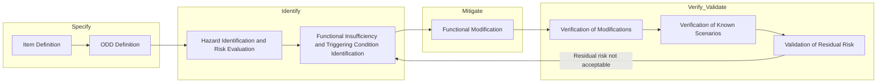
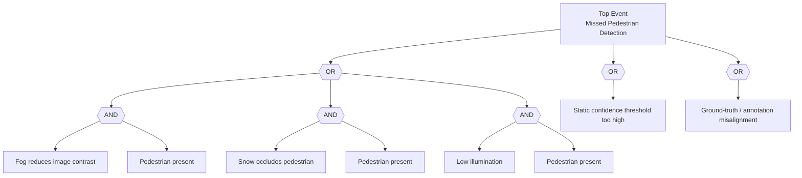

# SOTIF-Based-Functional-safety-for-Vision-Perception-for-Autonomous-Driving
## Purpose and scope of this document
This project documentation applies the structure and terminology of **ISO 21448 — Road vehicles — Safety of the Intended Functionality (SOTIF)** to a pedestrian-detection perception function, evaluated under synthetically generated adverse weather conditions (fog, snow, low-light).
 
This is an academic project to demonstrate the **process discipline** of SOTIF engineering: defining the Operational Design Domain (ODD), identifying functional insufficiencies and triggering conditions, evaluating risk, defining functional modifications, and proposing a verification & validation (V&V) strategy.
 
Where the project is a research effort rather than a released product.

## 1. Item Definition (Clause 6)

| Attribute | Description |
|---|---|
| **Item** | Camera-based pedestrian detection function |
| **Function** | Detect and localize pedestrians in the forward field of view of a monocular camera (JAAD dataset used monocular camera), output bounding boxes for downstream use (e.g. driver warning) |
| **Algorithm** | YOLO11l (You Only Look Once, v11, large variant) |
| **Sensing modality** | Single RGB camera (monocular), as sourced from JAAD |
| **Intended use** | Perception input to an ADAS pedestrian-protection function (e.g. forward collision warning / Automated Emergency Braking  |
| **Boundary of analysis** | Detection performance only — this project does not evaluate tracking, sensor fusion, or the downstream decision/actuation logic |

## 2. Clause 6 — SOTIF Engineering Cycle: ODD Definition, Hazard Identification, and Risk Evaluation

The project follows the SOTIF "specify → identify → evaluate → mitigate → verify/validate" cycle:

### 6.2 Operational Design Domain (ODD) Definition
 
The ODD constrains the conditions under which the pedestrian-detection function is claimed to operate as intended.
 
| ODD dimension | Definition for this project |
|---|---|
| **Road type** | Urban/suburban roads (as represented in JAAD) |
| **Scenery** |  crosswalk with pedestrian presence |
| **Lighting** | Daylight (nominal), low-light as edge/adverse condition |
| **Weather** | Clear (nominal), fog and snow as adverse conditions under evaluation |
| **Sensor state** | Single forward-facing camera, no lens obstruction or physical degradation modeled |
| **Traffic participants** | Pedestrians only (in-scope); vehicles/cyclists out of scope for this iteration |

**Nominal ODD** = clear weather, daylight.
**Adverse/edge-of-ODD conditions under test** = fog, snow, darkness — synthetically injected via `imagecorruptions` and custom gamma reduction (`fog.py`, `snow.py`, `dark.py`).

  <h3>Fog Severity Comparison</h3>
  <table>
    <tr>
      <th>orginal picture</th>
      <th>Severity 1</th>
      <th>Severity 2</th>
      <th>Severity 3 </th>
      <th>Severity 4 </th>
      <th>Severity 5</th>
    </tr>
    <tr>
      <td></td>
      <td></td>
      <td></td>
      <td></td>
      <td></td>
      <td></td>
    </tr>
  </table>

   

  <h3>Snow Severity Comparison</h3>
  <table>
    <tr>
      <th>orginal picture</th>
      <th>Severity 1</th>
      <th>Severity 2</th>
      <th>Severity 3 </th>
      <th>Severity 4 </th>
      <th>Severity 5</th>
    </tr>
    <tr>
      <!-- REPLACE THE 'src' LINKS BELOW WITH YOUR SNOW IMAGE ASSET LINKS -->
      <td></td>
      <td></td>
      <td></td>
      <td></td>
      <td></td>
      <td></td>
    </tr>
  </table>

 
### 6.3 Hazard Identification
 
| Hazard ID | Hazardous behavior | Potential harm |
|---|---|---|
| H-01 | Failure to detect a present pedestrian (false negative) | Collision with pedestrian |
| H-02 | Late detection (correct detection, but too late for safe reaction) | Reduced time-to-react, possible collision |
| H-03 | flickering detection | Delayed warning/braking |
| H-04 | False positive detection  | Unnecessary braking, potential rear-end collision (out of scope for detection-only eval, noted for completeness) |

### 6.4 Risk Evaluation (Qualitative)
 
Using a simplified severity/exposure/controllability rationale (correpomdent to ISO 26262 ASIL reasoning):
 
| Hazard | Severity | Exposure (adverse weather + pedestrian present) | Controllability (by driver/system) | Qualitative risk |
|---|---|---|---|---|
| H-01 (missed detection) | High (potential fatality) | Medium (weather events + pedestrian co-occurrence) | Low (driver may have no cue) | **High priority** |
| H-02 (late detection) | High | Medium | Low–Medium | **High priority** |
| H-03 (flicker) | Medium | Medium | Medium | Medium priority |

### 6.5 SOTIF Area Classification (Known/Unknown × Safe/Unsafe)
 
ISO 21448 frames the entire scope of a function's behavior space into four areas. The purpose of the SOTIF process as a whole is to move scenarios from Area 3 into Area 2 (via analysis), and from Area 2 into Area 1 (via mitigation and verification) — the residual size of Areas 2 and 3 is the actual safety argument.

| Area | Definition | This project's mapping |
|---|---|---|
| **Area 1 — Known Safe** | Identified scenarios where the function is shown to behave safely | Clear-weather / daylight detection on `video_0232`, where YOLO11l meets acceptable recall/precision (pending measured baseline) |
| **Area 2 — Known Unsafe** | Identified scenarios where the function is shown to behave unsafely | Fog, snow, and dark conditions where recall drops and H-01/H-02 (missed/late detection) are observed — this is the direct output of the Clause 6/7/10 evaluation in this project |
| **Area 3 — Unknown Unsafe** | Scenarios not yet identified/tested, where the function would fail if tested | Not covered by this project: e.g. rain, fog+darkness combined, partial occlusion by other objects, non-JAAD scenes, different camera/sensor hardware, other pedestrian poses/clothing not represented in `video_0232` |
| **Area 4 — Unknown Safe / Irrelevant** | Scenarios not tested, but genuinely safe or outside the ODD | scenarios entirely outside the defined ODD, such as off-road or highway-only driving with no pedestrian exposure |

How this project moves the needle:

Before this work: fog/snow degradation on this pedestrian-detection model was unknown (Area 3 or 4, undetermined) nobody had measured it.
After this work: it becomes known — specifically Area 2 (Known Unsafe), because the evaluation shows degraded recall under these conditions. That reclassification, from unknown to known-unsafe, is the safety-relevant contribution of a SOTIF evaluation project, even before any fix is implemented.

### 3. Clause 7 — Identification and Evaluation of Functional Insufficiencies and Triggering Conditions
### 3.1 Functional Insufficiencies
Per ISO 21448 terminology, a functional insufficiency is either an insufficiency of specification or a performance insufficiency. For this system:

- FI-01 (performance insufficiency): YOLO11l's feature extraction degrades under reduce visibility (fog), reducing objectness confidence below the detection threshold.
- FI-02 (insufficiency of specification): The model's confidence threshold was tuned for clean and daylight conditions and is not adapted per-condition, so a single static threshold is itself a specification gap.

### 3.2 Triggering Conditions

A triggering condition is the specific circumstance that activates a functional insufficiency into a hazardous behavior.
| Triggering condition | Linked FI | Description |
|---|---|---|
| TC-01 | FI-01 | Fog density above a level that reduces scene contrast beyond model's training distribution |
| TC-02 | FI-02 | Snowfall particle density overshadowing pedestrian visibility |

### 3.3 FTA Analysis

## 4. Clause 8 — Functional Modification
 
Per ISO 21448, once functional insufficiencies and triggering conditions are identified, **functional modifications** are proposed to reduce risk. These may be specification changes, design changes, or ODD restrictions — not just "make the model better."
 
| Modification ID | Type | Description | Linked to |
|---|---|---|---|
| FM-01 | Design change (sensor redundancy) | Add a Radar sensor modality less affected by fog and fuse with camera output, so a fog-degraded camera detection can be backed up by another sensor | FI-01 |
| FM-02 | Design change (algorithmic) | retrain YOLO11l on fog-augmented training data (domain adaptation) so feature extraction is more robust to low-visibility inputs | FI-01 |
| FM-03 |	Design change (adaptive thresholding) | Replace the static confidence threshold with one conditioned on an estimated visibility/weather class (e.g. lower threshold when fog is detected, since true positives will naturally have lower confidence) | FI-02 |
| FM-04 | ODD restriction (fallback)e | If neither FM-01 nor FM-03 is feasible, restrict the ODD to require reduced automation/driver takeover when visibility estimate drops below a defined level | FI-01 |

 
 
---

## Future Work
